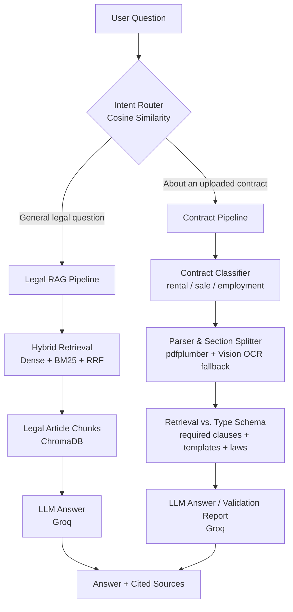

# ⚖️ Egyptian Legal Assistant

**An Arabic AI assistant that answers Egyptian legal questions and reviews uploaded contracts — grounded strictly in real legal sources and the contract's own text, with zero invented information.**

<p align="center">
  
  
  
  
  
</p>

---

## 📖 Overview

Legal information in Egypt is scattered across dense, formal Arabic texts — and most people don't have a lawyer on speed dial to ask "is this clause even legal?" **Egyptian Legal Assistant** closes that gap with two tightly-focused capabilities in one system:

1. **Legal Q&A** — ask a general legal question in Arabic and get an answer grounded only in retrieved articles from real Egyptian law texts, with sources cited.
2. **Contract Review** — upload a rental, sale, or employment contract (PDF *or* a scanned photo) and ask questions about it. Every answer comes strictly from that contract's own clauses — the system also flags missing or problematic clauses against a per-contract-type checklist.

No hallucinated articles, no invented clauses, no guessing — if it's not in the sources, the assistant says so.

---

## ✨ Features

- **Arabic-aware text pipeline** — extracts and cleans Arabic legal/contract text from PDFs, with automatic detection and correction of reversed or font-corrupted extraction (a common `pdfplumber` pitfall with Arabic PDFs)
- **Vision OCR fallback** — scanned or photographed contracts are read via Groq's vision model when direct text extraction fails or comes out corrupted
- **Precise chunking** — legal text is split article-by-article, and contracts are split clause-by-clause, so retrieval and answers stay tightly scoped
- **Hybrid retrieval (Dense + BM25 + RRF)** — combines semantic search (`multilingual-e5-base` embeddings) with keyword search (BM25), merged via Reciprocal Rank Fusion for the most relevant matches
- **Smart intent routing** — a cosine-similarity router decides whether an incoming question is general legal Q&A or contract-specific, and sends it down the right pipeline
- **Contract classification** — automatically detects contract type (rental / sale / employment) and validates it against a type-specific schema of required clauses
- **Conversation-aware retrieval** — detects when a follow-up question depends on earlier chat context and rewrites it before searching, so "and what about the deposit?" actually finds the right clause
- **Source-transparent answers** — the frontend shows exactly which article number or contract clause/page backs up each answer

---

## 🧩 Architecture



---

## 🛠️ Tech Stack

| Layer | Tools |
|---|---|
| **API** | FastAPI |
| **Vector store** | ChromaDB |
| **Embeddings** | Sentence-Transformers (`multilingual-e5-base`) |
| **Keyword search** | BM25 (Okapi), fused with dense search via Reciprocal Rank Fusion |
| **LLM inference** | Groq — Llama 3.1 / 3.3 (text), Qwen Vision (OCR) |
| **PDF/text extraction** | pdfplumber, pdf2image, OpenCV |
| **Frontend** | Simple web UI for contract upload + source-cited chat |

---

## 📂 Project Structure

```
backend/
├── main.py                       # FastAPI app entrypoint
├── pipeline.py                   # Orchestrates the end-to-end flow
├── intent_router.py              # Legal vs. contract question routing
├── chatbot.py                    # Legal Q&A RAG chat logic
├── pdf_render.py                 # Legal source PDF extraction
├── chunking.py                   # Article-level chunking for legal texts
├── vector_store.py                # ChromaDB indexing/query helpers
├── contract_parser.py            # Contract PDF/image extraction + section splitting
├── contract_classifier.py        # Contract type classification (rental/sale/employment)
├── contract_retriever.py         # Schema + template + law retrieval for contracts
├── contract_chat.py              # Contract validation summary + follow-up Q&A
├── find_clause_section.py        # Clause-matching helper for validation
├── build_contract_chunks.py      # Builds contract template chunks
├── build_template_embeddings.py  # Precomputes template embeddings
├── session_store.py              # Conversation/session state
└── search_test.py / embeddings_test.py  # Retrieval experimentation scripts

data/            # Legal texts, contract templates, schemas
frontend/        # Contract upload + chat UI
chroma_db/       # Persisted vector store
```

---


## 🎥 Project Demo

Watch the demo here:
[https://drive.google.com/...](https://drive.google.com/drive/folders/1vuTS0vzdE6EL482LBOkR-WgCxn6W2BrD?usp=sharing)

---

## 🚀 Getting Started

### Prerequisites
- Python 3.10+
- A [Groq API key](https://console.groq.com)

### Installation

```bash
git clone https://github.com/MotazSameh/AI-Legal-Assistant.git
cd AI-Legal-Assistant/backend

python -m venv venv
source venv/bin/activate      # Windows: venv\Scripts\activate

pip install -r requirements.txt
```

### Environment variables

Create a `.env` file inside `backend/`:

```env
GROQ_API_KEY=your_groq_api_key_here
```

### Build the knowledge base (first run only)

```bash
python build_contract_chunks.py
python build_template_embeddings.py

```

### Run the API

```bash
python main.py
```

Then open the frontend (in `frontend/`) and start asking questions — or upload a contract.

---

## 💬 Example Usage

**Legal question:**
> "إيه حكم القانون المصري في تأخير سداد الإيجار؟"
→ Answer grounded in the relevant civil law articles, with the article number cited.

**Contract question (after upload):**
> "هل بيانات الطرف الأول كاملة؟"
→ Answer pulled strictly from that contract's own clause, flagged against the rental-contract schema if anything required is missing.

---

## 🧠 What We Learned

Beyond the NLP and RAG theory, this project was a crash course in real-world debugging: Arabic text-cleaning edge cases, reversed/corrupted PDF extraction, a stray OCR page-number silently splitting a clause in half, and a generation parameter (`presence_penalty`) that turned out to be the reason an "Arabic-only" model occasionally leaked foreign tokens into its answers. The theory gets you 80% of the way there — the last 20% is always in the debugger.

---

## 👥 Team

- Moataz Sameh
- Mohammed Shaaban
- Abdelrahman Samy
- Demiana Morice
- Radwa Mamdouh

Built during the NLP track at **NTI** (National Telecommunication Institute).

---

## 📄 License

This project is licensed under the [MIT License](LICENSE).
